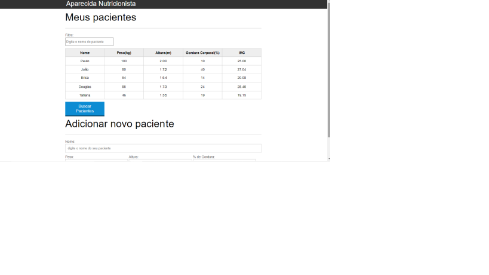
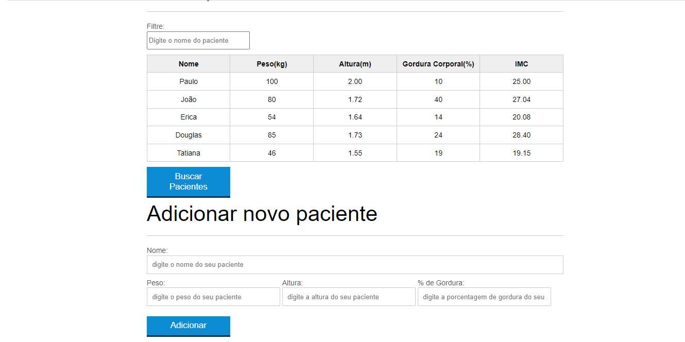

# IMC

 

# Sobre o projeto

É uma aplicação simples no qual o usuário entra com seus dados de altura e peso e gera o calcúlo IMC do mesmo. Utiliza-se o DOM para manipulação dinâmica de HTML (criar e remover),
bem como o objeto RegExp para criação de expressões regulares para realizar filtragem de registros. Possue também uma pequena dose de AJAX para buscar dados estáticos de pacientes
em JSON e jogar para alimentar a tabela.

## Layout mobile
 
